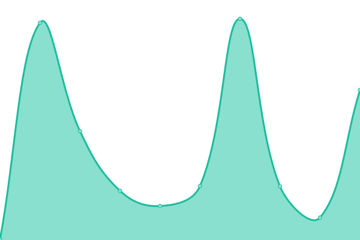
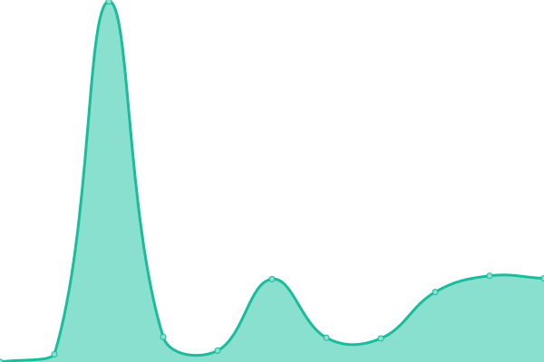

# [📈 Live Status](https://status.trance-0.com): <!--live status--> **🟧 Partial outage**

This repository contains the open-source uptime monitor and status page for [Upptime](https://upptime.js.org), powered by [Upptime](https://github.com/upptime/upptime).

With [Upptime](https://upptime.js.org), you can get your own unlimited and free uptime monitor and status page, powered entirely by a GitHub repository. We use [Issues](https://github.com/upptime/upptime/issues) as incident reports, [Actions](https://github.com/Trance-0/upptime/actions) as uptime monitors, and [Pages](https://status.trance-0.com) for the status page.

<!--start: status pages-->
<!-- This summary is generated by Upptime (https://github.com/upptime/upptime) -->
<!-- Do not edit this manually, your changes will be overwritten -->
<!-- prettier-ignore -->
| URL | Status | History | Response Time | Uptime |
| --- | ------ | ------- | ------------- | ------ |
|  [INDEX](https://index.trance-0.com) | 🟩 Up | [index.yml](https://github.com/Trance-0/upptime/commits/HEAD/history/index.yml) | 

 202ms
     
 | 

<a href="https://status.trance-0.com/history/index">100.00%</a>
    

|  [Blog](https://www.trance-0.com) | 🟩 Up | [blog.yml](https://github.com/Trance-0/upptime/commits/HEAD/history/blog.yml) | 

 10538ms
     
 | 

<a href="https://status.trance-0.com/history/blog">94.32%</a>
    

|  [NextCloud](https://nextcloud.trance-0.com) | 🟥 Down | [next-cloud.yml](https://github.com/Trance-0/upptime/commits/HEAD/history/next-cloud.yml) | 

 1405ms
     
 | 

<a href="https://status.trance-0.com/history/next-cloud">99.66%</a>
    

|  [Codebook](https://code.trance-0.com) | 🟩 Up | [codebook.yml](https://github.com/Trance-0/upptime/commits/HEAD/history/codebook.yml) | 

 164ms
     
 | 

<a href="https://status.trance-0.com/history/codebook">100.00%</a>
    

|  [NoteNextra](https://notenextra.trance-0.com) | 🟩 Up | [note-nextra.yml](https://github.com/Trance-0/upptime/commits/HEAD/history/note-nextra.yml) | 

 355ms
     
 | 

<a href="https://status.trance-0.com/history/note-nextra">100.00%</a>
    

|  [Portainer](https://portainer.trance-0.com) | 🟩 Up | [portainer.yml](https://github.com/Trance-0/upptime/commits/HEAD/history/portainer.yml) | 

 177ms
     
 | 

<a href="https://status.trance-0.com/history/portainer">100.00%</a>
    

|  [Jenkins](https://portainer.trance-0.com) | 🟩 Up | [jenkins.yml](https://github.com/Trance-0/upptime/commits/HEAD/history/jenkins.yml) | 

 38ms
     
 | 

<a href="https://status.trance-0.com/history/jenkins">100.00%</a>
    

|  [NAS](https://nas.trance-0.com) | 🟩 Up | [nas.yml](https://github.com/Trance-0/upptime/commits/HEAD/history/nas.yml) | 

 1389ms
     
 | 

<a href="https://status.trance-0.com/history/nas">100.00%</a>
    

|  [NPS](https://nps.trance-0.com) | 🟩 Up | [nps.yml](https://github.com/Trance-0/upptime/commits/HEAD/history/nps.yml) | 

 229ms
     
 | 

<a href="https://status.trance-0.com/history/nps">100.00%</a>
    

|  [Sophia's path (frontend)](https://www.sophiaspath.org) | 🟩 Up | [sophia-s-path-frontend.yml](https://github.com/Trance-0/upptime/commits/HEAD/history/sophia-s-path-frontend.yml) | 

 450ms
     
 | 

<a href="https://status.trance-0.com/history/sophia-s-path-frontend">100.00%</a>
    

|  [Sophia's path (backend)](https://sophiaspathbackend-production.up.railway.app/admin) | 🟩 Up | [sophia-s-path-backend.yml](https://github.com/Trance-0/upptime/commits/HEAD/history/sophia-s-path-backend.yml) | 

 5458ms
     
 | 

<a href="https://status.trance-0.com/history/sophia-s-path-backend">100.00%</a>
    

<!--end: status pages-->

[**Visit our status website →**](https://status.trance-0.com)

## 📄 License

- Powered by: [Upptime](https://github.com/upptime/upptime)
- Code: [MIT](./LICENSE) © [Anand Chowdhary](https://anandchowdhary.com), supported by [Pabio](https://pabio.com)
- Data in the `./history` directory: [Open Database License](https://opendatacommons.org/licenses/odbl/1-0/)
